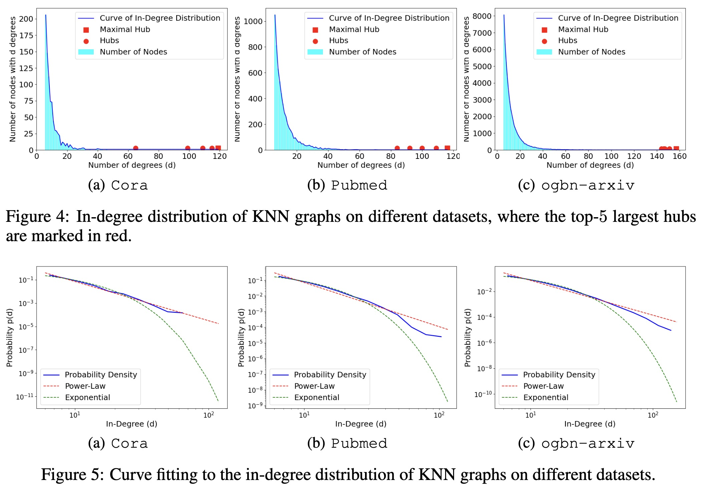

# Scale-Free Graph-Language Models (ICLR 2025)
Codes for paper [Scale-Free Graph-Language Models](https://openreview.net/forum?id=nFcgay1Yo9)




## Datasets

Datasets can be download from  [here](https://github.com/XiaoxinHe/TAPE). Please place the downloaded files in the folder `dataset`.


## Installation
```bash
conda env create -f SFGL_environment.yml
```


## Usage

see bash files:
```bash
bash 23arxiv_gnn.sh
bash 23arxiv_gnn_lm.sh
bash 23arxiv_gnn_lm_gpt.sh
bash 23arxiv_gnn_lm_gnn.sh
```

The experimental results will be saved in "tmp_results" folder.

# Reference

    @inproceedings{
      lu2025scalefree,
      title={Scale-Free Graph-Language Models},
      author={Jianglin Lu and Yixuan Liu and Yitian Zhang and Yun Fu},
      booktitle={The Thirteenth International Conference on Learning Representations},
      year={2025},
      url={https://openreview.net/forum?id=nFcgay1Yo9}
    }

# Acknowledgement
Our codes are mainly built on [TAPE](https://github.com/XiaoxinHe/TAPE). We gratefully thank the authors for their contributions. 
